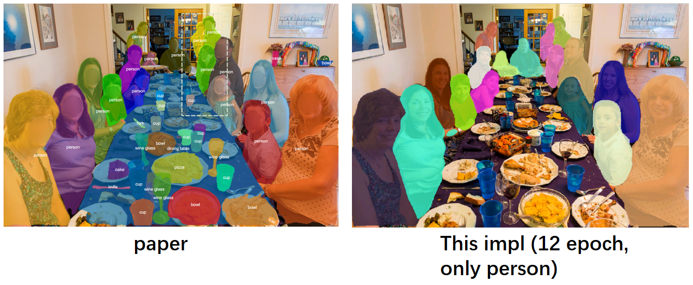

# TensorMask
### The code is unofficial version for [TensorMask: A Foundation for Dense Object Segmentation](https://arxiv.org/abs/1903.12174).

* 

### Reuirments
1. python==3.7
1. pytorch==1.0.0
2. torchvision==0.4.2
3. opencv-python,pycocotools,progress,numpy,easydict

### Installation
```bash
git clone https://github.com/CaoWGG/TensorMask.git	
cd TensorMask/models/ops/align2nat
python setup.py build_ext --inplace
cd TensorMask/models/ops/sigmoid_focal_loss
python setup.py build_ext --inplace
```
	
### Training
```bash
## dataset coco2017
## modify config.py : cfg.class_name and cfg.num_class
python train.py
```

### Show result
```bash
python demo.py
## show window
python show_pred_window.py
```
