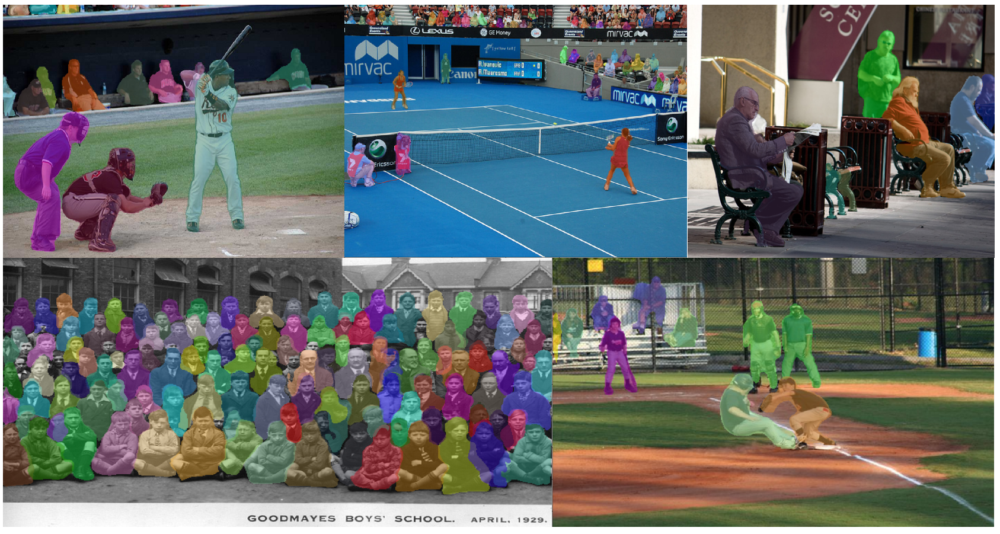

# TensorMask
### The code is unofficial version for [TensorMask: A Foundation for Dense Object Segmentation](https://arxiv.org/abs/1903.12174).

* 
* 

input_size = (640x512), no multi-scale training, no multi-scale test 

|class|AP|AP<sub>50</sub>|AP<sub>75</sub>|AP<sub>S</sub>|AP<sub>M</sub>|AP<sub>L</sub>|
|---|---|---|---|---|---|---|
|person box|0.481|0.752|0.503|0.256|0.559|0.704|
|person mask|0.395|0.721|0.392|0.184|0.454|0.614|

### Reuirments
1. python==3.7
1. pytorch==1.0.0
2. torchvision==0.4.2
3. opencv-python,pycocotools,progress,numpy,easydict

### Installation
```bash
git clone https://github.com/CaoWGG/TensorMask.git	
cd TensorMask/models/ops/align2nat
python setup.py build_ext --inplace
cd TensorMask/models/ops/sigmoid_focal_loss
python setup.py build_ext --inplace
```
	
### Training
```bash
## dataset coco2017
## modify config.py : cfg.class_name and cfg.num_class
python train.py
```

### Show result
```bash
python demo.py
## show window
python show_pred_window.py
```
